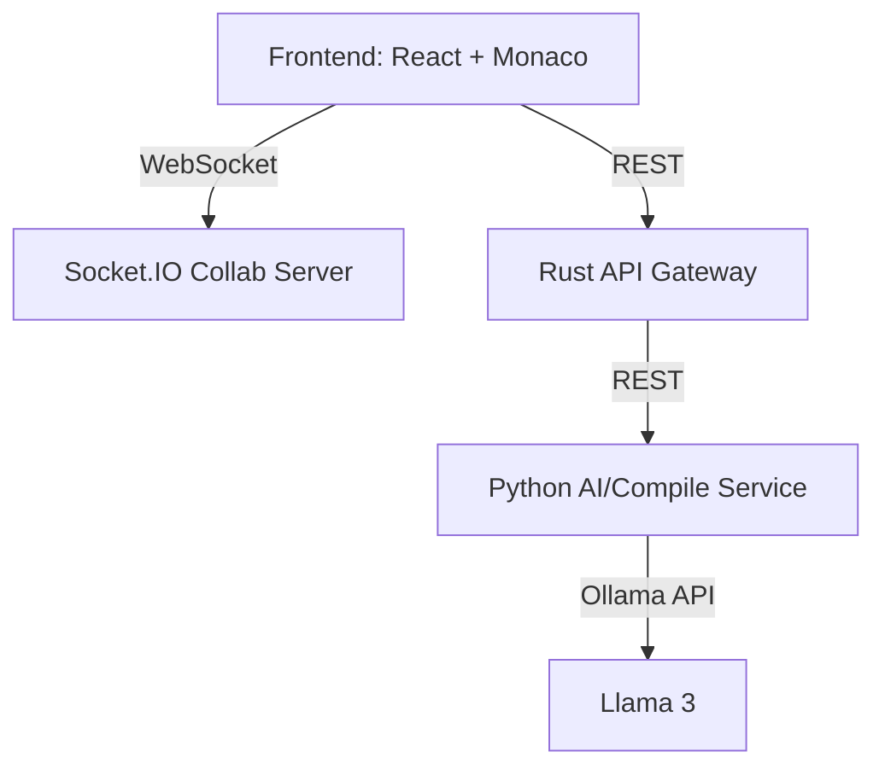

# CodeCollab AI

A real-time collaborative code editor with integrated AI-powered code review and live code compilation.

---

## **Features**
- **Real-Time Collaborative Editing:** Multiple users can edit code together, see each other's presence, and share live updates.
- **AI-Powered Code Review:** Get instant suggestions, bug warnings, and code improvements from Llama 3 (Ollama).
- **Live Compilation:** Run Python and C code in real time and see output/errors instantly.
- **User Presence:** See who is online and editing with you.

---

## **Architecture Overview**



- **Frontend:** React + Monaco Editor, Redux, Socket.IO client
- **Rust Backend:** API gateway, forwards AI/compile requests to Python
- **Python Service:** FastAPI, connects to Ollama for code review, runs code in sandbox
- **Socket.IO Server:** Node.js, manages real-time presence and file sync

---

## **Setup & Run Instructions**

### 1. **Start Ollama (Llama 3)**
```
ollama serve
ollama pull llama3
```

### 2. **Start Python AI/Compile Service**
```
cd backend/src
pip install fastapi uvicorn pydantic requests
python ai_review_service.py
```

### 3. **Start Rust Backend**
```
cd backend
cargo run
```

### 4. **Start Socket.IO Collab Server**
```
node collab-server.js
```

### 5. **Start Frontend**
```
cd frontend
npm install
npm start
```

---

## **Key Files**
- `frontend/src/pages/Editor.tsx` — Main collaborative editor UI
- `frontend/src/hooks/useFileSocket.ts` — Real-time socket logic
- `backend/src/ai_review_service.py` — AI review & code execution (Python)
- `backend/src/routers/ai_review.rs` — Rust API gateway for AI/compile
- `collab-server.js` — Node.js Socket.IO server for real-time presence

---

## **How It Works**
- **Edit code:** All users see changes in real time.
- **AI Review:** Click "AI Review" to get suggestions from Llama 3, shown inline and in a sidebar.
- **Run code:** Click "Run" to compile/execute Python or C code and see output/errors.
- **Presence:** See who is online and editing with you.

---

## **Extending & Customizing**
- Add more languages to the Python compile endpoint.
- Integrate authentication tokens for secure collaboration.
- Add live cursor/selection sharing for a Google Docs-like experience.

---

## **License**
MIT 